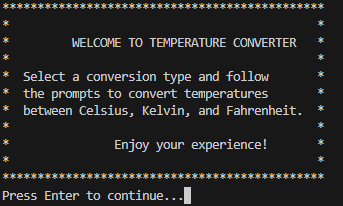

# Temperature Converter in COBOL



## Project Overview

This project is a **Temperature Converter** written in COBOL. It allows users to convert temperatures between Celsius, Fahrenheit, and Kelvin. The program was designed as a command-line interface application that prompts users to select the conversion type, enter the temperature value, and displays the converted result.

## Functionality

The Temperature Converter offers six types of conversions:

1. **Celsius to Kelvin**
2. **Celsius to Fahrenheit**
3. **Kelvin to Celsius**
4. **Kelvin to Fahrenheit**
5. **Fahrenheit to Celsius**
6. **Fahrenheit to Kelvin**

After each conversion, users are asked if they would like to perform another conversion. The program ends when the user inputs 'N' in response to the prompt.

### Example of Conversion Prompts

For each conversion, the program displays:

- A message describing the conversion type.
- A prompt to enter the temperature.
- The result in the converted unit.

### Sample Flow

1. User sees the welcome screen.
2. User selects an option (e.g., 1 for Celsius to Kelvin).
3. User enters the temperature in Celsius.
4. Program calculates and displays the temperature in Kelvin.
5. Program prompts the user to perform another conversion or quit.

## How to Execute

### Requirements

To compile and run this COBOL program, you'll need:

- **GnuCOBOL** (or another COBOL compiler). GnuCOBOL can be installed on Linux, Windows, and macOS. Check [GnuCOBOL’s installation guide](https://gnucobol.sourceforge.io/) for specific instructions.

### Compilation and Execution Steps

1. **Compile the Program**

   Use the following command to compile the COBOL file:

    ```bash
        cobc -x -o TemperatureConverter TemperatureConverter.cob
    ```

    - -x: Tells GnuCOBOL to compile and link the file as an executable.
    - -o TemperatureConverter: Specifies the output executable name.

2. **Run the Program**

    Once compiled, you can execute the program with:

    ```bash
        ./TemperatureConverter
    ```

    Follow the on-screen prompts to select a conversion type, input temperature values, and view the results.

If you need a Dockerfile to build a COBOL project on a different operating system, you can find it in the [Docker-Hub repository](https://github.com/fonteeboa/docker-build-library) on GitHub under the cobol directory. This Dockerfile provides a portable environment to compile and run COBOL code using GnuCOBOL.

## License

This project is licensed under the MIT License. See the LICENSE file for more details.

## Motivation

The primary motivation behind this project was curiosity in learning COBOL. Despite being an older language, COBOL remains widely used in financial, governmental, and large-scale enterprise systems. Through building this temperature converter, I explored COBOL syntax, structured programming, and user interaction in a console environment.

Thank you for checking out this COBOL project! If you have any suggestions or feedback, feel free to reach out.
